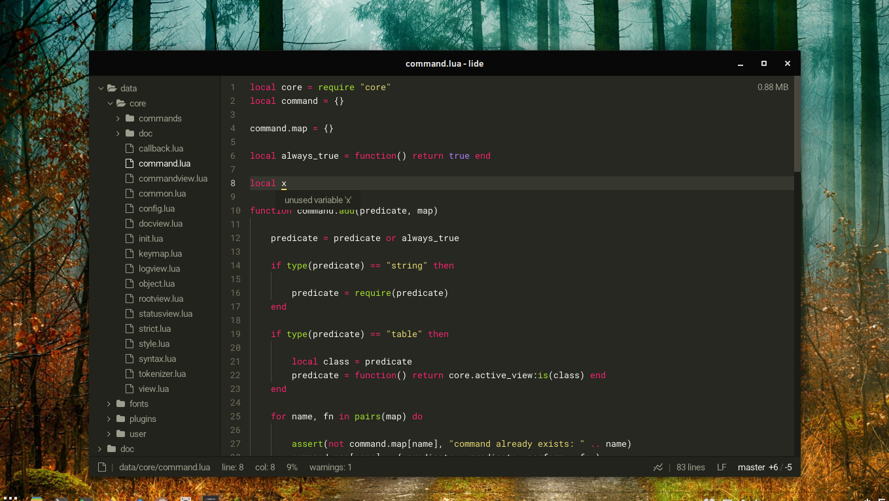

# lide

Lide is a lightweight text editor written in Lua. A fork from the [lite](https://github.com/rxi/lite) by rxi.
Lide has (or will have) IDE features, like `goto definition`, `spy references` and other things like that.

## Overview
This repository is just a personal project of how I use the editor and what changes I found necessary for **my** use. 
Consequently, most pull requests and issues I may miss because they are outside my main focus with it.

## Building
This program only supports Linux building because I'm a Linux user, but if you are really interested 
in using it you can copy the windows libs from the parent repository and then build it using the .bat file found there too.

## License
This project is free software; you can redistribute it and/or modify it under
the terms of the MIT license. See [LICENSE](LICENSE) for details.
